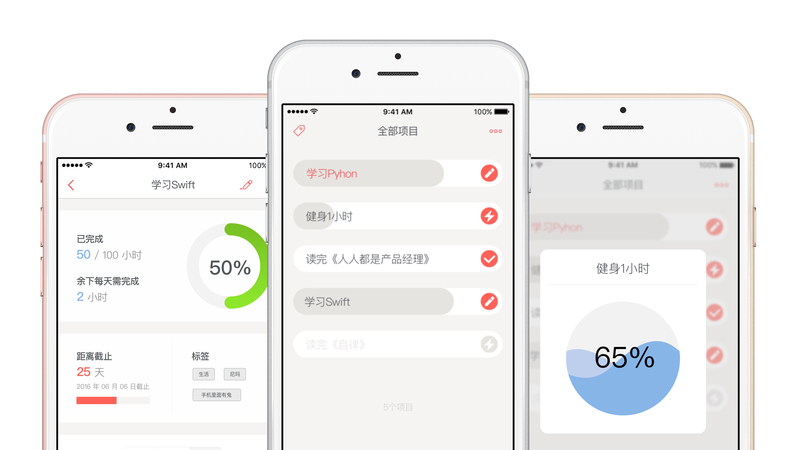

# 马克计划
  
##安排和记录你的个人计划  

###内容提要
马克计划是一款 iOS 平台上的个人项目（目标）进度管理应用，旨在帮助你完成个人项目的计划安排和进度管理，以便更好地管理个人时间和完成预期目标。马克计划适用于个人项目的安排和记录——计划一个有明确开始和结束时间的项目，在每完成一定进度后进行记录，并根据记录情况安排今后的项目进度。你可以使用马克计划来安排记录短期个人生活、学习的项目——如读完某本书、学完某门公开课，也可以用于长期目标或习惯养成——如每天读书半小时、学习编程 1 万小时。 
 

###下载

